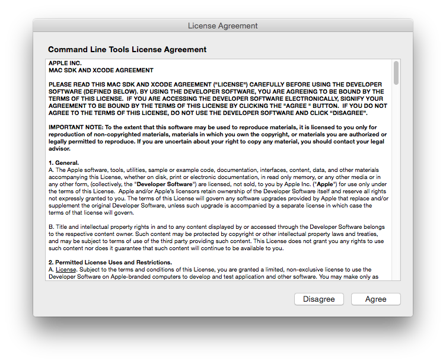
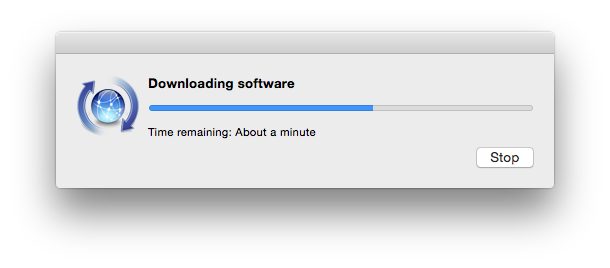
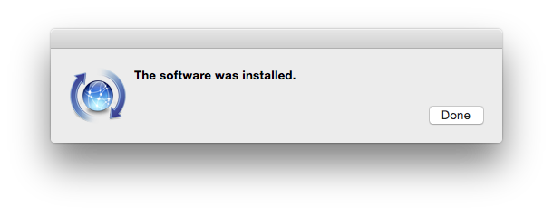

# OS X Setup

These are a set of scripts I've created to setup my OS X box. I've learned quite a bit from other folks dotfiles and install scripts and do my best to provide acknowledgments. Essentially Mathias Bynens has been the major contributor. His dotfile can be found here https://github.com/mathiasbynens/dotfiles.

There's an order to the scripts.

1. `check.sh`
2. `initialize.sh`
3. `setup.sh`
4. `osx.sh`

Each script has it's purpose.

## `check.sh`

`check.sh` essentially validates that you have some prerequisits before you start. Specifically we are looking for `git` and an Internet connection. The script will instruct you through these easy installs if you do not have them already. Otherwise the script will let you know all is good.

## `initialize.sh`

`initialize.sh` will start the base install of tools and applications. Essentially this is homebrew doing the major lifting. At this time there is onlyl one tool I cannot install via homebrew, `gvm`.

## `setup.sh`

`setup.sh` is a combination of environmental setups (e.g. copying dotfiles in the home directory) as well as some additional installations. At some point I may be able to combine `initialize.sh` and `setup.sh` in one script but I've kept them separate for now.

## `osx.sh`

`osx.sh` sets up some OS X specifics (e.g. Terminal defaults, Dock adjustments) that I prefer.

## Requirements

To run these scripts the OS X box will need to need to meet a few requirements.

- Internet connection
- Xcode command line tools i.e. `git`

I've created a script to test for these requirements. And yes, if you can run this you should already have an Internet connection.

    $ curl -s https://raw.githubusercontent.com/wsgavin/osxinit/master/check.sh | sh

If an OS X fresh install you will probably have to do the following.

    $ xcode-select --install

The following are the expected windows that will pop up during the install.
Click 'Install':

Click 'Agree':

Downloading and Installed:

Once you are here the installation is finished.

TODO: Install vs. Xcode and go ahead and download java.

I did this because I was not initially aware of the process and thought documenting how to get there was worth it. For me it's trivial now, but for the uninitiated probably worth the understanding.

Once complete the `check.sh` script should tell you it's all good to go.

TODO: Have it spit out the commands below.

## OS X Initialization Files

Let's checkout the git repository, cd into osxinit and run `initialize.sh`.

    $ git clone https://github.com/wsgavin/osxinit.git
    $ cd osxinit
    $ ./initialize.sh

## Java

For Minecraft, the latest Java update from Apple is required. You can find the download at the following URL.

https://support.apple.com/kb/DL1572?locale=en_US

Follow the instructions provided on the site.

## TODO

### OS X settings

- Screen Saver
