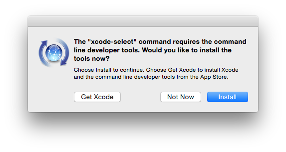

# OS X Setup

These are a set of scripts I've created to setup my OS X box. I've learned quite a bit from other folks dotfiles and install scripts and do my best to provide acknowledgments. Essentially Mathias Bynens has been the major influence. His dotfile can be found here https://github.com/mathiasbynens/dotfiles.

There's an order to the scripts.

1. `check.sh`
2. `initialize.sh`
3. `setup.sh`
4. `osx.sh`

## `check.sh`

`check.sh` essentially validates that you have some prerequisites before you start. Specifically we are looking for `git` and an Internet connection. The script will instruct you through these any installs if you do not meet the requirements already. Otherwise the script will let you know all is good.

I wrote this script because I was not initially aware of the process and thought documenting how to get there was worth it. For me it's trivial now, but for the uninitiated probably worth the understanding.

## `initialize.sh`

`initialize.sh` will start the base install of tools and applications. Essentially this is homebrew doing the major lifting. At this time there is only one tool I cannot install via homebrew, `gvm`.

## `setup.sh`

`setup.sh` is a combination of environmental setups (e.g. copying dotfiles in the home directory) as well as some additional installations. At some point I may be able to combine `initialize.sh` and `setup.sh` in one script but I've kept them separate for now.

## `osx.sh`

`osx.sh` sets up some OS X specifics (e.g. Terminal defaults, Dock adjustments) that I prefer.

## Let's get started...

**N.B.** When running scripts you will not have to start with any `sudu` commands. They are embedded in the script when needed.

To run these scripts the OS X box will need to need to meet a few requirements.

- Your account is an administrator
- Internet connection
- Xcode command line tools i.e. `git`

Run the following command below.

    $ curl -s https://raw.githubusercontent.com/wsgavin/osxinit/master/check.sh | sh

If it's reported that you do not have an Internet connection you likely have some issues. I say this because the script itself is downloaded via the Internet. Apologies, but I cannot help here.

If you find you are not in the `admin` group you will need to work with your system administrator. Otherwise you will not get far installing software.

If an OS X fresh install you will probably have to install some Xcode tools. The script will inform you what to run. For convenience I have put it below as well.

    $ xcode-select --install

The following are the expected windows that will pop up during the install.
Click 'Install':

Once you click install you will need to agree to the license agreement. After that the install will download and install `xcode-select` tools.

Once you feel you have corrected any issues run the script again. Once all the checks pass you will be greeted with a message saying "All good to go..." and will instruct you on the next steps.

TODO: Install vs. Xcode and go ahead and download java.

Once complete the `check.sh` script should tell you it's all good to go.

TODO: Have it spit out the commands below.

## OS X Initialization Files

Let's checkout the git repository, cd into osxinit and run `initialize.sh`.

    $ git clone https://github.com/wsgavin/osxinit.git
    $ cd osxinit
    $ ./initialize.sh

## Java

For Minecraft, the latest Java update from Apple is required. You can find the download at the following URL.

https://support.apple.com/kb/DL1572?locale=en_US

Follow the instructions provided on the site.

## TODO

### OS X settings

- Screen Saver
- Document Soloarized: https://github.com/tamul/solarized-osx-terminal-colors
- Document mysides: https://github.com/mosen/mysides

### Sublime Setup Notes

~/Library/Application Support/Sublime Text 3/Packages/User/

Package Control.sublime-settings
Preferences.sublime-settings
Default (OSX).sublime-keymap
Markdown.sublime-settings

### Parallels Notes

- 2 CPU 8 GB RAM 512MB Video
- No Sharing
- Configure to not save energy.
- Update
- Install Parallels Tools
